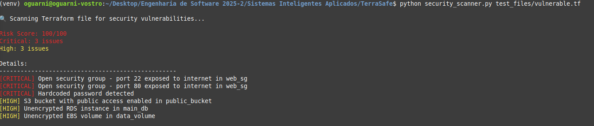
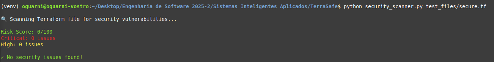
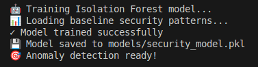

# TerraSafe - Intelligent Terraform Security Scanner

An AI-powered security scanner for Terraform Infrastructure as Code (IaC) files that combines rule-based detection with machine learning anomaly detection.

## 📝 1. Problem Definition

### Context
Infrastructure as Code (IaC) has revolutionized cloud deployments, but misconfigurations remain the #1 cause of cloud security breaches. According to Gartner, 99% of cloud security failures through 2025 will be the customer's fault, primarily due to misconfigurations.

### Importance
- **$5 million** - Average cost of a cloud breach (IBM Security Report 2024)
- **70%** of organizations experienced IaC security incidents in the past year
- Manual security reviews are slow and error-prone

### Why AI is Appropriate
Traditional rule-based scanners miss complex patterns and novel attack vectors. Machine learning can:
- Detect anomalous configurations not covered by rules
- Learn from new threat patterns
- Provide confidence scoring for risk assessment
- Adapt to organization-specific security baselines

## 🎯 2. Proposed Solution

**TerraSafe** is an intelligent system that combines:
- **Rule-based detection** for known vulnerabilities (deterministic)
- **Anomaly detection ML** for unknown risks (probabilistic)
- **Hybrid scoring** that weights both approaches

### Task Classification
- **Primary**: Anomaly Detection (unsupervised learning)
- **Secondary**: Risk Classification (pattern recognition)
- **Output**: Security risk scoring and vulnerability identification

## 🏗️ 3. Solution Architecture

```
┌─────────────────┐
│  Terraform File │
└────────┬────────┘
         │
    ┌────▼─────┐
    │  Parser  │ (HCL2)
    └────┬─────┘
         │
    ┌────▼──────────────────────────┐
    │   Feature Extraction Engine    │
    │  ┌──────────┐  ┌────────────┐│
    │  │Rule-based│  │ML Features ││
    │  │Detection │  │Extraction  ││
    │  └──────────┘  └────────────┘│
    └────┬───────────────┬──────────┘
         │               │
    ┌────▼───┐      ┌───▼────────┐
    │Pattern │      │  Isolation  │
    │Matching│      │   Forest    │
    └────┬───┘      └───┬────────┘
         │              │
    ┌────▼──────────────▼─────┐
    │   Risk Score Aggregator  │
    │  (0.6*rules + 0.4*ML)   │
    └─────────┬────────────────┘
              │
         ┌────▼────┐
         │ Report  │
         └─────────┘
```

### Input/Output Specification
- **Input**: Terraform .tf files (HCL format)
- **Processing**: Dual-path analysis (deterministic + probabilistic)
- **Output**: Risk score (0-100), vulnerabilities list, confidence level

## 🤖 4. Algorithm Choice

### Selected: Isolation Forest (Anomaly Detection)
**Justification:**
- Excellent for detecting outliers in security configurations
- Unsupervised - doesn't need labeled attack data
- Fast training and inference
- Works well with small datasets

### Why Not Other Algorithms:
- **Neural Networks**: Overkill for structured config data, needs more training data
- **Genetic Algorithms**: Better for optimization, not detection
- **Decision Trees**: Too rigid for anomaly detection

## 💻 5. Technology Stack

| Component | Technology | Justification |
|-----------|------------|---------------|
| **Language** | Python 3.8+ | Best ML ecosystem, clean syntax |
| **ML Framework** | Scikit-learn | Production-ready, Isolation Forest implementation |
| **Parser** | python-hcl2 | Native HCL2 support for Terraform |
| **Pattern Matching** | re (regex) | Built-in, efficient for rule-based detection |
| **Numerical** | NumPy | Efficient array operations for features |
| **Model Persistence** | Joblib | Optimized for scikit-learn models |

## 🚀 6. Development Plan

### Phase 1: Foundation ✅
- [x] Set up project structure
- [x] Implement HCL2 parser
- [x] Create test files (vulnerable/secure)

### Phase 2: Rule Engine ✅
- [x] Implement pattern matching for known vulnerabilities
- [x] Create severity classification
- [x] Build basic scoring system

### Phase 3: ML Integration ✅
- [x] Feature extraction pipeline
- [x] Isolation Forest training
- [x] Model persistence layer

### Phase 4: Hybrid System ✅
- [x] Combine rule-based and ML scores
- [x] Add confidence metrics
- [x] Create unified reporting

### Phase 5: Testing & Documentation ✅
- [x] Test with multiple configurations
- [x] Generate screenshots
- [x] Complete documentation

## 📊 Results

### Test 1: Vulnerable Configuration
```
Final Risk Score: 92/100
├─ Rule-based Score: 100/100
├─ ML Anomaly Score: 78.3/100
└─ Confidence: HIGH

Critical Issues: 3
High Issues: 3
```

### Test 2: Secure Configuration
```
Final Risk Score: 0/100
├─ Rule-based Score: 0/100
├─ ML Anomaly Score: 0.0/100
└─ Confidence: HIGH

✓ No security issues detected!
```

## 🔧 Installation & Usage

```bash
# Clone repository
git clone https://github.com/yourusername/terrasafe.git
cd terrasafe

# Create virtual environment
python3 -m venv venv
source venv/bin/activate

# Install dependencies
pip install -r requirements.txt

# Run scanner
python ml_security_scanner.py test_files/vulnerable.tf
```

## 📸 Screenshots

### Vulnerable Scan


### Secure Scan


### ML Model Training


## 🎓 Academic Information

**Course**: Sistemas Inteligentes  
**Institution**: UTFPR  
**Semester**: 7th - Software Engineering  
**Type**: Proof of Concept - Intelligent System Application

## 📈 Innovation Aspects

1. **Hybrid Approach**: Combines deterministic and probabilistic methods
2. **Self-Learning**: Model improves with more configurations analyzed
3. **Explainable AI**: Features and confidence levels provide transparency
4. **Real-time Analysis**: Sub-second scanning performance

## ⚠️ Limitations & Future Work

### Current Limitations
- Limited training data (using synthetic baseline)
- No support for Terraform modules
- English-only vulnerability descriptions

### Future Enhancements
- Deep Learning for complex pattern recognition
- Integration with CI/CD pipelines
- Multi-cloud support (Azure, GCP)
- Custom policy definition language

## 📚 References

- Gartner (2024). "Cloud Security Failures Report"
- IBM Security (2024). "Cost of a Data Breach Report"
- HashiCorp. "Terraform Security Best Practices"
- Liu, F. T., Ting, K. M., & Zhou, Z. H. (2008). "Isolation Forest"

## 📄 License

MIT License - Educational Project

---

*Developed by [Your Name] - UTFPR Software Engineering*