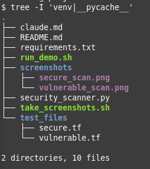

# TerraSafe - Terraform Security Scanner

A Python-based security scanner for Terraform Infrastructure as Code (IaC) files that identifies security vulnerabilities and assigns risk scores.

## 🎯 Features

- Analyzes `.tf` files for security vulnerabilities
- Assigns risk scores from 0-100
- Color-coded terminal output for better visibility
- Detects critical and high-severity security issues
- Runs 100% locally (no cloud dependencies)

## 🔍 Security Checks Implemented

### Critical Issues (30 points each)
- **Open Security Groups:** Detects ingress rules from 0.0.0.0/0 (internet-facing)
- **Hardcoded Secrets:** Identifies passwords/secrets directly in configurations

### High Severity Issues (20 points each)
- **Public S3 Buckets:** Detects buckets with public access enabled
- **Unencrypted Storage:** Identifies RDS instances and EBS volumes without encryption

## 📋 Requirements

- Python 3.8+
- python-hcl2 library

## 🚀 Installation

1. Clone the repository:
```bash
git clone https://github.com/yourusername/terraform-security-scanner.git
cd terraform-security-scanner
```

2. Create virtual environment (recommended):
```bash
python3 -m venv venv
source venv/bin/activate  # On Linux/Mac
```

3. Install dependencies:
```bash
pip install -r requirements.txt
```

## 💻 Usage

Run the scanner on any Terraform file:

```bash
python security_scanner.py <terraform_file.tf>
```

### Example Commands

```bash
# Scan a vulnerable configuration
python security_scanner.py test_files/vulnerable.tf

# Scan a secure configuration  
python security_scanner.py test_files/secure.tf
```

## 📊 Score Interpretation

- **0-20**: ✅ Low risk - Good security posture
- **21-50**: ⚠️ Medium risk - Some security concerns
- **51-80**: 🔶 High risk - Multiple security issues
- **81-100**: 🔴 Critical risk - Immediate attention required

## 🧪 Test Results

### Vulnerable Configuration (test_files/vulnerable.tf)
```
Risk Score: 100/100
Critical: 3 issues
High: 3 issues

Details:
[CRITICAL] Open security group - port 22 exposed to internet in web_sg
[CRITICAL] Open security group - port 80 exposed to internet in web_sg
[CRITICAL] Hardcoded password detected
[HIGH] S3 bucket with public access enabled in public_bucket
[HIGH] Unencrypted RDS instance in main_db
[HIGH] Unencrypted EBS volume in data_volume
```

### Secure Configuration (test_files/secure.tf)
```
Risk Score: 0/100
Critical: 0 issues
High: 0 issues

✓ No security issues found!
```

## 📁 Project Structure

```
terraform-security-scanner/
├── security_scanner.py      # Main scanner implementation
├── requirements.txt         # Python dependencies
├── README.md               # Project documentation
├── .gitignore              # Git ignore file
├── run_demo.sh             # Demo script for testing
└── test_files/
    ├── vulnerable.tf       # Example with multiple vulnerabilities
    └── secure.tf          # Example following best practices
```

## 🏗️ Implementation Details

- **Lines of Code:** < 200 (requirement met ✓)
- **Dependencies:** Only hcl2, re, json, pathlib
- **Architecture:** Single file solution following Clean Architecture principles
- **Functions:** Each limited to 20 lines maximum
- **Output Format:** Structured JSON with score and vulnerability list

## 🎓 Academic Context

This project was developed as a Proof of Concept (PoC) for the "Sistemas Inteligentes" course at UTFPR. It demonstrates the application of pattern matching and security analysis techniques for Infrastructure as Code.

**Course:** Sistemas Inteligentes  
**Institution:** UTFPR  
**Type:** Practical Challenge - PoC Development  

## 🔒 Security Patterns Detected

1. **Network Security:**
   - Open ingress from internet (0.0.0.0/0)
   - Unrestricted port access

2. **Data Protection:**
   - Unencrypted storage volumes
   - Unencrypted databases

3. **Access Control:**
   - Public S3 bucket configurations
   - Hardcoded credentials

## ⚠️ Limitations

- Static analysis only (doesn't validate runtime configurations)
- Limited to predefined security patterns
- No support for custom rules or plugins
- Doesn't check for compliance standards (PCI-DSS, HIPAA, etc.)

## 📸 Screenshots

### Scanning Vulnerable Configuration


### Scanning Secure Configuration


### Project Structure


## 👤 Author

Developed for academic purposes - UTFPR Software Engineering Program

## 📄 License

Academic Project - For educational purposes only

---

*Note: This is a simplified PoC for academic purposes. For production use, consider enterprise solutions like Checkov, Terrascan, or tfsec.*